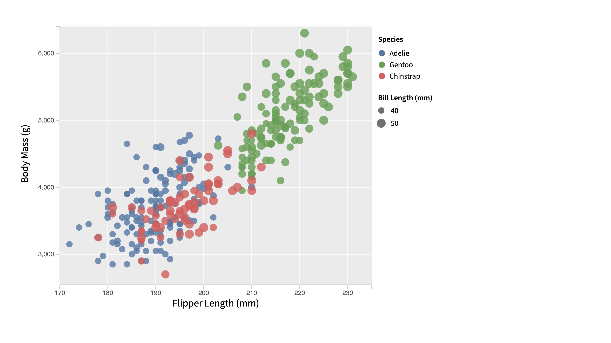
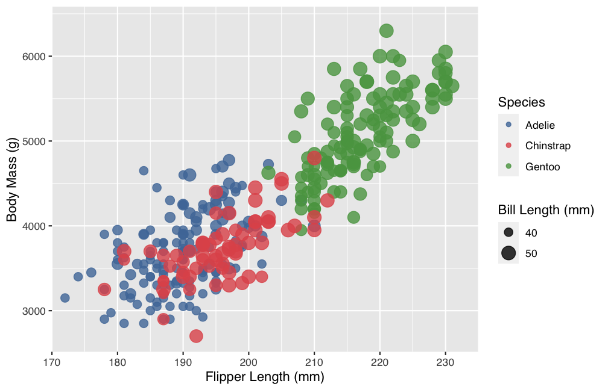
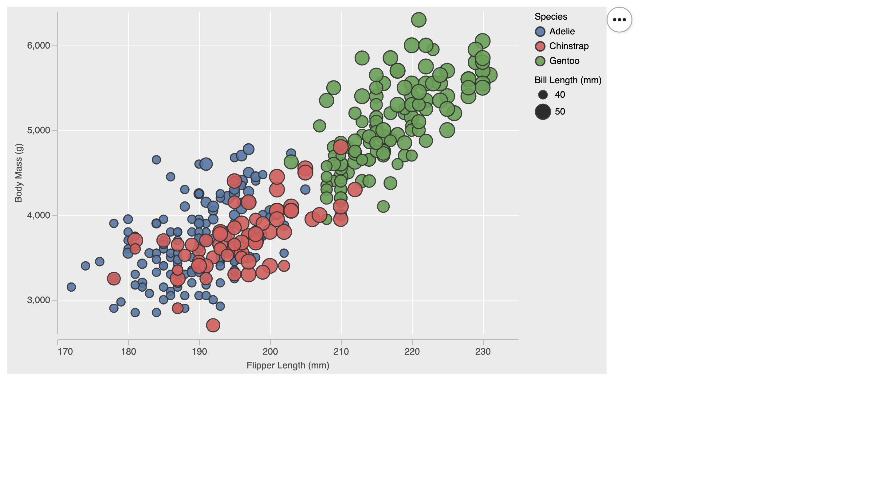
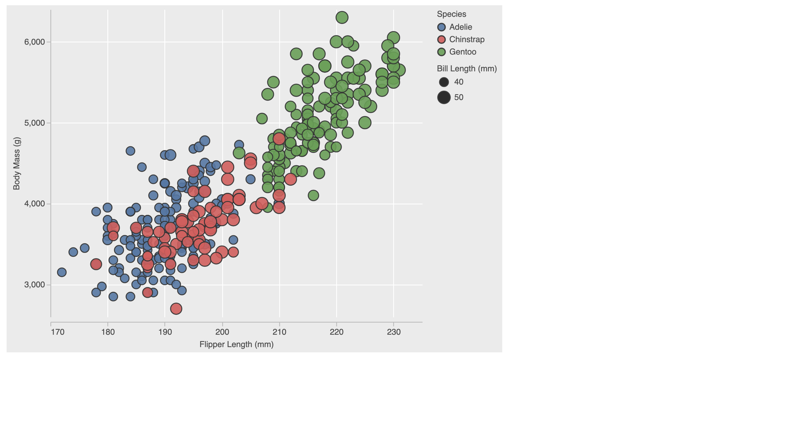
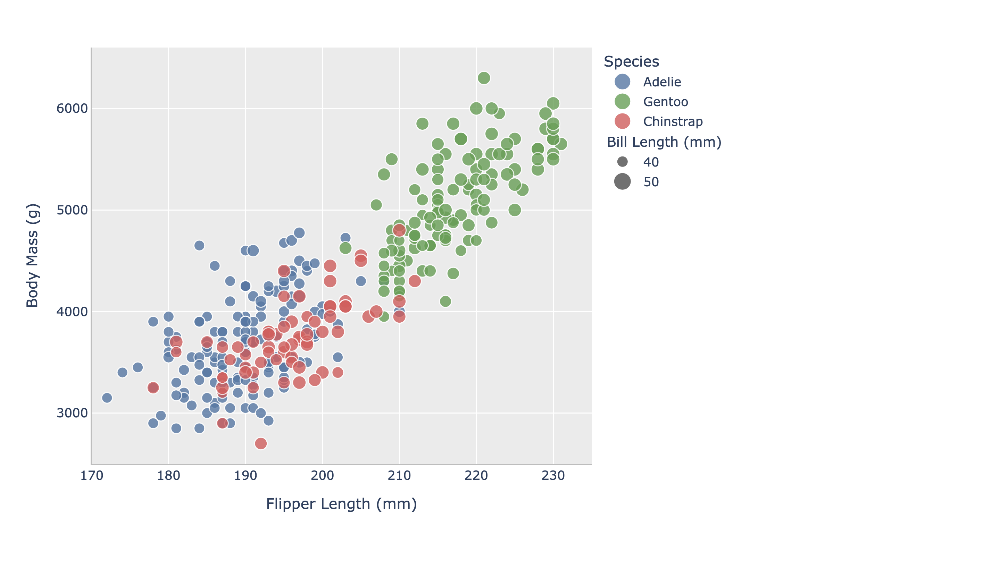

# 02-DataVis-5ways

Assignment 2 - Data Visualization, 5 Ways  
===

Now that you have successfully made a "visualization" of shapes and lines using d3, your next assignment is to successfully make a *actual visualization*... 5 times. 

The goal of this project is to gain experience with as many data visualization libraries, languages, and tools as possible.

I have provided a small dataset about penguins, `penglings.csv`.
Each row contains a penguin observation and several variables about it, including bill length, flipper length, and more.

Your goal is to use 5 different tools to make the following chart:

These features should be preserved as much as possible in your replication:

- Data positioning: it should be a upward-trending scatterplot as shown.  Flipper Length should be on the x-axis and Body Mass on the y-axis.
- Scales: Note the scales do not start at 0.
- Axis ticks and labels: both axes are labeled and there are tick marks at a reasonable interval, e.g 10, 20, 30, etc.
- Color mapping to species.
- Size mapping to Bill Length.
- Opacity of circles set to 0.8 or similar for a semi-transparent effect.

Other features are not required. This includes:

- The background grid.
- The legends.

Note that some software packages will make it **impossible** to perfectly preserve the above requirements. 
Be sure to note where these deviate as you reflect on what a tool is good for.

Improvements are also welcome as part of Technical and Design achievements.

Libraries, Tools, Languages
---

You are required to use 5 different tools or libraries.
Of the 5 tools, you must use at least 3 libraries (libraries require code of some kind).
This could be `Python, R, Javascript`, or `Java, Javascript, Matlab` or any other combination.
Dedicated tools (i.e. Excel) do not count towards the language requirement.

Otherwise, you should seek tools and libraries to fill out your 5.

Below are a few ideas. Do not limit yourself to this list!
There are new tools coming out every year and we may not have an exhaustive list of the latest and greatest.

Some may be difficult choices, like Matlab or SPSS, which require large installations, licenses, and occasionally difficult UIs.

I have marked a few that are strongly suggested.

- R + ggplot2 `<- definitely worth trying`
- Excel
- d3 `<- since the rest of the class uses this, we're requiring it`
- Altair `<- hugely popular python library. highly recommended `
- three.js `<- well, it's a 3d library. not really recommended, but could be interesting and fun`
- p5js `<- good for playing around. not really a chart lib`
- Tableau
- PowerBI
- Vega-lite <- `<- very interesting formal visualization model; might be the future of the field`
- Flourish <- `<- popular in recent years`
- DataWrapper <- `<- popular in recent years`
- GNUplot `<- the former CS department head uses this all the time :)`
- SAS/SPSS/Matlab

You may write everything from scratch, or start with demo programs from books or the web. 
If you do start with code that you found, please identify the source of the code in your README and, most importantly, make non-trivial changes to the code to make it your own so you really learn what you're doing. 

Tips
---

- If you're using d3, key to this assignment is knowing how to load data.
You will likely use the [`d3.json` or `d3.csv` functions](https://d3js.org/d3-dsv) to load the data you found.

**Beware that these functions are *asynchronous*, meaning it's possible to "build" an empty visualization before the data actually loads. Figuring out how to do this properly can be a major hiccup if you haven't used async functions before. If this means you, start part of this project early so you don't end up in a rush!**

- *For web languages like d3* Don't forget to run a local webserver when you're debugging.
See my a1 video or online tutorials for how to do this.
Being able to host a local webserver is an essential web development skill and very common in visualization design as well.

Readme Requirements
---

A good readme with screenshots and structured documentation is required for this project. 
It should be possible to scroll through your readme to get an overview of all the tools and visualizations you produced.

- Each visualization should start with a top-level heading (e.g. `# d3`)
- Each visualization should include a screenshot. Put these in an `img` folder and link through the readme (markdown command: ``.
- Write a paragraph for each visualization tool you use. What was easy? Difficult? Where could you see the tool being useful in the future? Did you have to use any hacks or data manipulation to get the right chart?

Other Requirements
---

0. Your code should be forked from the GitHub repo.
1. Place all code, Excel sheets, etcetera in a named folder. For example, `r-ggplot, matlab, mathematica, excel` and so on.
2. Your writeup (readme.md in the repo) should also contain the following:

- Description of the Technical achievements you attempted with this visualization.
  - Some ideas include interaction, such as mousing over to see more detail about the point selected.
- Description of the Design achievements you attempted with this visualization.
  - Some ideas include consistent color choice, font choice, element size (e.g. the size of the circles).

GitHub Details
---

- Fork the GitHub Repository. You now have a copy associated with your username.
- Make changes to fulfill the project requirements. 
- To submit, make a [Pull Request](https://help.github.com/articles/using-pull-requests/) on the original repository.

Grading
---

Grades on a 120 point scale. 
24 points will be based on your Technical and Design achievements, as explained in your readme. 

Make sure you include the files necessary to reproduce your plots.
You should structure these in folders if helpful.
We will choose some at random to run and test.

# d3

I used d3 to build the scatterplot directly in the browser with an SVG. It was easy to map color and size once the scales were set up, but the harder part was handling async CSV loading and keeping ticks consistent while adding hover behavior. I could see d3 being best for highly customized, interactive visualizations on the web. The main “hack” was manually tuning domains/ticks to align with the reference.

# R + ggplot2

ggplot2 made the visual mapping straightforward using aesthetics for x, y, color, and size. It was easy to get a clean baseline chart, while the more difficult part was tuning axis limits and tick breaks to match the non‑zero scales. ggplot2 feels ideal for quick, publication‑style plots. I did clamp bill length for consistent sizing and used explicit scale breaks to match the reference.

# Python + Altair

Altair’s declarative syntax made it easy to replicate the scatterplot with the right encodings. The toughest part was matching axis domains and tick values, but once that was set the rest was simple. I’d use Altair for rapid, interactive prototypes; the hover highlight + tooltip were easy to add. The only real tweak was explicit domain/tick control.

# Vega-Lite

Vega‑Lite was approachable because the spec is compact and mirrors the visual encodings directly. It was easy to add gridlines and legends, but I had to be precise about axis domains and tick values to match the rubric. I can see Vega‑Lite being useful for portable, declarative specs that render anywhere. The only “hack” was setting explicit tick values to enforce 1000‑unit steps, plus a simple hover selection for interaction.

# Python + Plotly

Plotly was straightforward for quick charts with polished defaults. It was easy to set ranges, gridlines, and consistent colors; the tricky part was getting tick spacing and legend layout to match the other tools. I’d use Plotly for dashboards or rapid sharing. The main adjustment was nudging margins and the legend position to avoid label clipping.

## Technical Achievements
- **Hover interactions**: Built tooltips + hover highlights in d3, Altair, and Vega‑Lite so you can inspect values without changing the chart.
- **Explicit scales**: Set non‑zero domains and tick values in each tool to mirror the reference chart.
- **Data cleaning**: Filtered out rows with missing values so only valid points were plotted.

### Design Achievements
- **Shared visual language**: Kept the same species colors and size range across all tools so the charts read the same.
- **Custom fonts**: Applied a custom font in the web‑based charts to keep labels and legends consistent.
- **Legend + grid consistency**: Kept legends and gridlines consistent across all visualizations.
